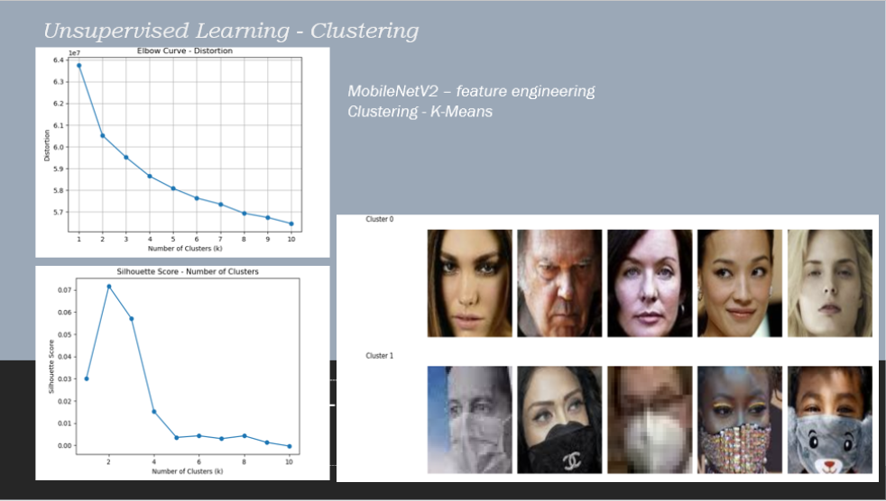
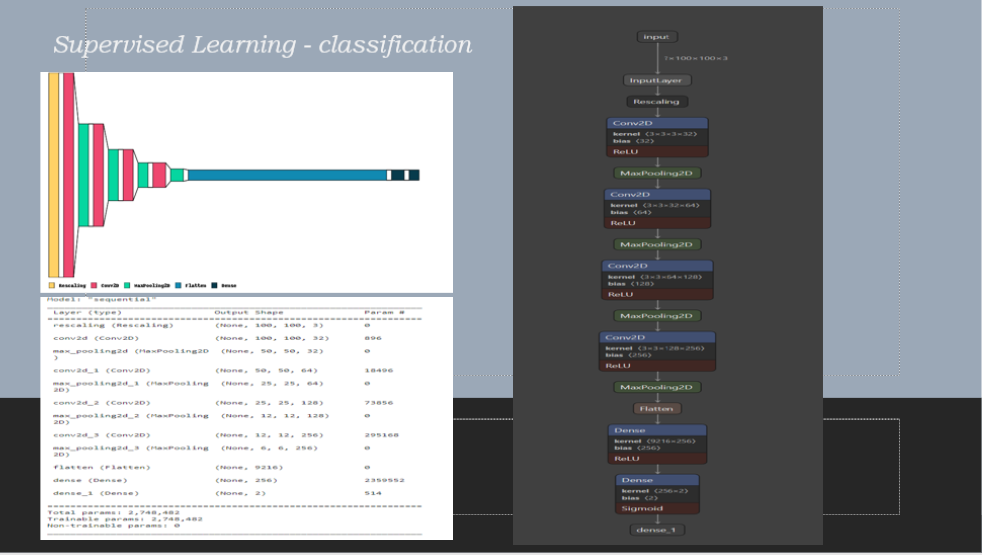
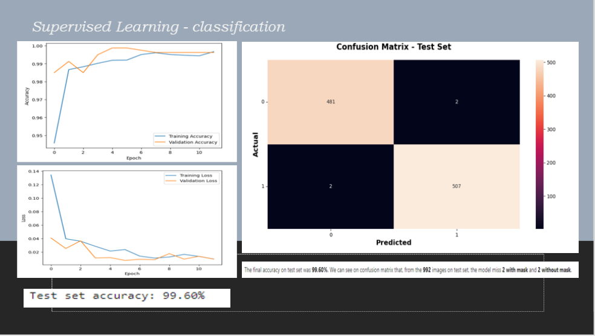
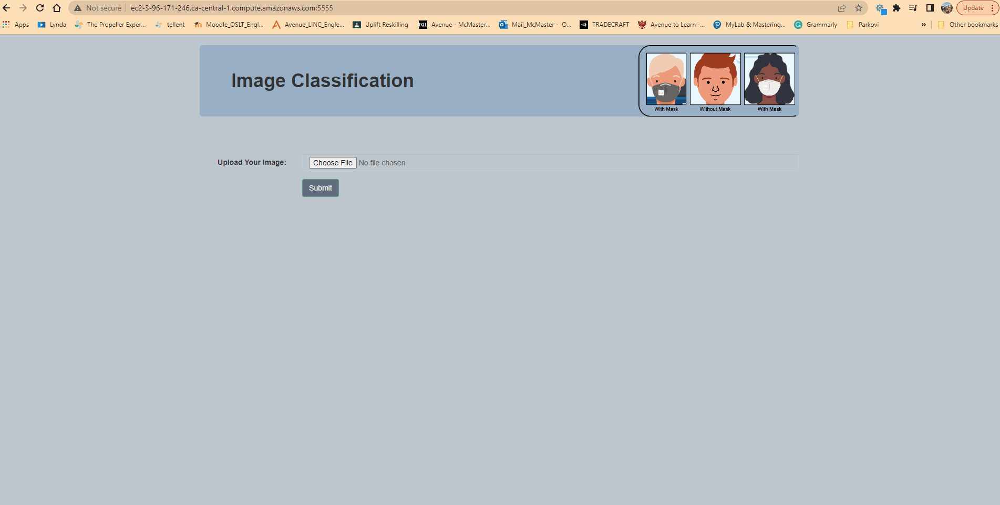

# Project8_Final_Project
COVID-19 Mask Detection: Image Clustering and Classification

## Project/Goals
The goal of this project is to develop an image analysis system that can cluster and classify images of people wearing and not wearing masks, specifically focusing on the context of COVID-19.

in files:

#### [unsupervis_learning](unsupervis_learning_clastering.ipynb)

#### [suprvise_learning](suprvise_learning_classification_keras_cnn.ipynb)

#### [API-Flask](src/app.py)

## Results/Demo

## Future Goals

In the future, I would like to try real time mask detection using a webcam and OpenCV.

## Data

The dataset can be downloaded from Kaggle [here](https://www.kaggle.com/datasets/ashishjangra27/face-mask-12k-images-dataset).